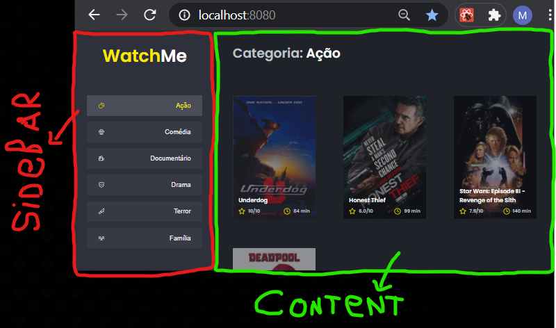
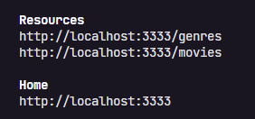

<h1 align="center"> React Challenge 02 Completed</h1>

<p> 🖥️ One challenge launched by <a href="https://rocketseat.com.br/" target:"blank">Rocketseat</a>, which we must create one app, 
where your main objective is to refactor a page for listing the films according to genre.
</p>


Table of contents
=================
<!--ts-->
   * [Table of contents](#table-of-contents)
   * [About the Challenge](#about-the-challenge)
   * [Installation](#installation)
   * [Technology](#technology)
<!--te-->


About the Challenge
===================

<h3> Edit three files, Content.tsx, SideBar.tsx and App.tsx </h3>
<p> 🗡️ When you use <a href="https://github.com/rocketseat-education/ignite-template-componentizando-a-aplicacao" target:"blank">"Rocketseat TEMPLATE "</a> this src/App.tsx has all the app, you need change it. </p>
<p> 🗡️ src/components/SideBar.tsx, this component is empty, must have all function and responsible body for the title of the site and the navigation the left side. </p>
<p> 🗡️ src/components/Content.tsx this component is empty, must have all function and responsible body for the header and app content. </p>


<p> This is how App.tsx should look like. </p>
<p> 🗡️ The app has only one main functionality, which is the listing of films.</p>
<p> 🗡️ In the <Strong>SideBar</Strong> it's possible to select which category of films should be listed.</p>
<p> 🗡️ The first category of list (It's action) it should already start as marked.</p>
<p> 🗡️ The app <Strong>Header</Strong> has only the name of the selected category that must change dynamically.</p>

<h4> We will use FAKE API with JSON server, in the URL http://localhost:3333 </h4>

<p>⚔️IMPORTANT!! My challenge is completed, if you want to solve this challenge, use this template: <a href="https://github.com/rocketseat-education/ignite-template-componentizando-a-aplicacao" target:"blank">" TEMPLATE "</a>! ⚔️ </p>

Installation
============
```
#Clone the repository
  SSH
  $ git clone git@github.com:KevinMCruzP/reactChallenge02.git
  
  or
  
  HTTPS
  $ git clone https://github.com/KevinMCruzP/reactChallenge02.git
```

```
#Install the dependencies
  $ npm install

or

  $ yarn
```

```
#Run the fake API with JSON server in http://localhost:3333/genres or /movies
  $ npm run server

or

  $ yarn server
```

```
#Run the app in http://localhost:8080/
  $ npm run dev

or

  $ yarn dev
```


Technology
==========
🛠 Tools used in the construction of the project
- [React](https://reactjs.org/)
- [TypeScript](https://www.typescriptlang.org/)
- [JavaScript](https://developer.mozilla.org/en-US/docs/Web/JavaScript)

<p align="center" styles="color:#572364"><strong>networking 📩</strong></p>
<p align="center"> 
  <a href="https://www.instagram.com/kevin.pizarro.cruz/" target="blank">
    
  </a>
  <a href="https://www.linkedin.com/in/kevin-marlon-pizarro-cruz-22b369208/" target="blank">
    
	  
  </a>
</p>
<h4 align="center"> 
	🚧 README in construction... 🚀 🚧
</h4> 
